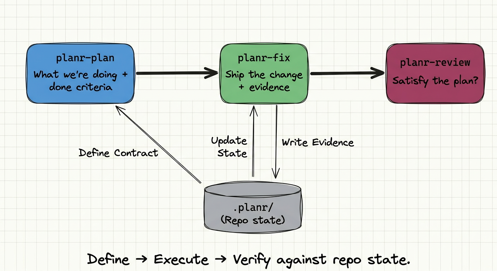

# codex-planr



Portable repo-local planning and execution workflow for Codex.

This repo gives you a small system you can copy into any codebase so agents work with explicit plans, honest status, scoped review, and real verification evidence instead of vague chat-state.

## Why This Exists

- Codex usually just needs a bit more repo-local guidance to finish tasks cleanly.
- Planr keeps scope, live status, and review evidence in the repo instead of vague chat-state.
- It has a hard-cut bias: no compact shims, quiet fallbacks, or unnecessary guards.
- Reviews lean on path-scoped Git evidence, which is more reliable than memory or optimistic checklist state.

## 3 Step Workflow

1. `$planr-plan`
   Define the scope, ownership, phases, verification, and acceptance criteria.
2. `$planr-fix`
   Implement the work and keep `.planr/status/current.json` honest.
3. `$planr-review`
   Audit the result against the plan, diff, and tests.


Optional skills to run after you finish a session:

- `$planr-status`
   Check the smallest honest verdict for the current scope.
- `$planr-summary`
   Recap what changed, what works, and what remains blocked or unverified.

## New Project Setup

1. From the root of the target repository:

```bash
mkdir -p .codex/skills
cp -R /path/to/codex-planr/.planr .
cp -R /path/to/codex-planr/.codex/skills/planr-* .codex/skills/
cp /path/to/codex-planr/.codex/skills/planr-shared.md .codex/skills/
```

2. Tell Codex to update the following files so they match your codebase:

```text
Inspect my current codebase and rewrite `.planr/project/*.md` for this repository.

Read:
- `.planr/project/product.md`
- `.planr/project/ownership.md`
- `.planr/project/flows.md`
- `.planr/project/state-ssot.md`
- `.planr/project/constraints.md`
- `.planr/project/quality-gates.md`

Then inspect the real codebase and update those files so they match:
- what this product actually is
- the real ownership boundaries and layers
- the main execution / request flows
- the real state sources of truth
- the verification and quality gates this repo should use

Do not leave generic template text behind.
```

`project init` scaffolds or refreshes the starter pack under `.planr/project/` and ensures `.planr/status/current.json` points at it. It does **not** infer real product, ownership, flow, or state boundaries for you.

## License

MIT. See `LICENSE.md`.
